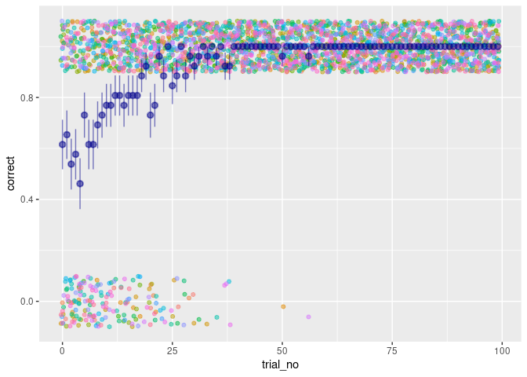
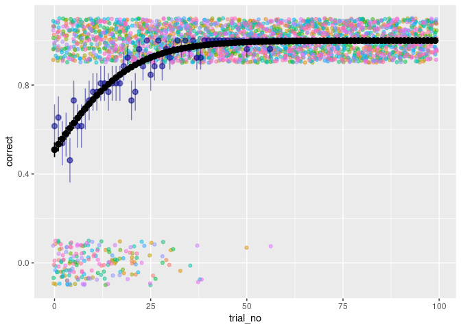
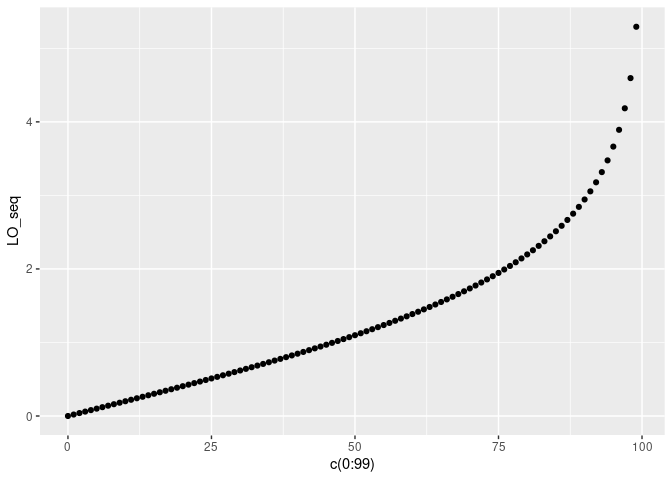
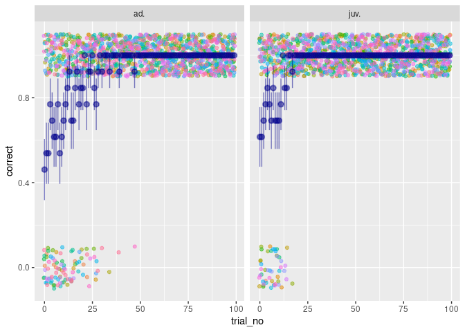

Logistic Regrets 1: intro to logistic regression
================
Michael Chimento

## Introduction

Modeling the probability of an animal producing one behavior or another
is a recurring theme in the study of animal behavior. This brief guide
is intended to establish some groundwork for how to approach the
analysis of behavioral choices. We will simulate some behavioral data,
and learn how to run and interpret a logistic GLM.

Logistic models are trickier than a standard linear model to interpret,
and running them on simulated data will allow us to see how the model
captures known structure in the data. We will further cover some basic
methods for plotting the inferred values of the model parameters, in
order to better understand how they would be useful in a real situation.

## Simulating data

Let’s imagine an experiment that you’ve just designed. You have a
population of birds (let’s say, great tits) that all have been banded
with an RFID code, so you can identify individuals. You have feeders
which have antennas that read their identity, and can give or deny
access to the feeder, based on the identity of the bird. You split the
birds into two groups, where Group A only has access to Feeder A, and
Group B only has access to Feeder B. You’d like to test how quickly the
birds learn, or, how the probability of choosing the “correct” feeder
changes with each visit to the feeder.

Let’s start by defining a vector of identities for individual birds. We
will take advantage of R’s letters variable, which contains the entire
lower case, English alphabet.

``` r
bird_ID = letters
print(bird_ID)
```

    ##  [1] "a" "b" "c" "d" "e" "f" "g" "h" "i" "j" "k" "l" "m" "n" "o" "p" "q" "r" "s"
    ## [20] "t" "u" "v" "w" "x" "y" "z"

The alphabet, as you may remember, has 26 letters, so we have 26 birds.
We can make a vector indicating which experimental group each bird
belongs to.

``` r
group = c(rep_len("A",13), rep_len("B",13))
print(group)
```

    ##  [1] "A" "A" "A" "A" "A" "A" "A" "A" "A" "A" "A" "A" "A" "B" "B" "B" "B" "B" "B"
    ## [20] "B" "B" "B" "B" "B" "B" "B"

Next, let’s assign an age variable to the birds. This will be binary,
either juvenile or adult. Let’s assume we’re being good scientists, and
we’ve balanced each group by age (well, almost).

``` r
age = rep_len(c("juv.","ad."),26)
print(age)
```

    ##  [1] "juv." "ad."  "juv." "ad."  "juv." "ad."  "juv." "ad."  "juv." "ad." 
    ## [11] "juv." "ad."  "juv." "ad."  "juv." "ad."  "juv." "ad."  "juv." "ad." 
    ## [21] "juv." "ad."  "juv." "ad."  "juv." "ad."

Cool, now let’s introduce our little friend, `rbinom()`. The process
were interested in, of choosing correct or incorrect, can be modeled as
a Bernoulli trial, in statistical speak. `rbinom()` generates series of
Bernoulli trials, and it takes three arguments: 1) the number of
observations we want, 2) the number of trials per observation, and 3)
the probability of a successful trial. Now, for the sake of simplicity,
let’s assume each bird has landed on either Feeder A or Feeder B 100
times. These are very precise birds\!

Let’s use `rbinom()` to model 100 trials from a bird which never learns.
It just randomly chooses between Feeder A and Feeder B, never learning
which is the right one, with p(Feeder\_A)=.5. In the following output, 0
is a fail (visit to Feeder B), and 1 is a success (visit to Feeder A).

``` r
correct = rbinom(100, 1, 0.5)
table(correct)
```

    ## correct
    ##  0  1 
    ## 45 55

Of course, this isn’t split exactly 50/50, there will be normal
variation around the expected probability we set. Let’s say it’s not
just this bird, but all of our birds are quite dull, or perhaps sick of
our incessant experiments. They want to eat, but refuse to learn. Let’s
make a dataframe to hold simulated data for the entire experimental
population. First, we’ll need to populate the data frame with 100 rows
per bird. Trial number will be indexed from 0, such that the first trial
will represent the intercept in our model.

``` r
df_empty = tibble(bird_ID,group,age) %>% 
  slice(rep(1:n(), each = 100)) %>%
  mutate(bird_ID = as.factor(bird_ID), group = as.factor(group), age = as.factor(age)) %>% 
  group_by(bird_ID) %>% 
  mutate(trial_no=c(0:99)) %>% 
  ungroup()
summary(df_empty)
```

    ##     bird_ID     group      age          trial_no    
    ##  a      : 100   A:1300   ad. :1300   Min.   : 0.00  
    ##  b      : 100   B:1300   juv.:1300   1st Qu.:24.75  
    ##  c      : 100                        Median :49.50  
    ##  d      : 100                        Mean   :49.50  
    ##  e      : 100                        3rd Qu.:74.25  
    ##  f      : 100                        Max.   :99.00  
    ##  (Other):2000

Next, let’s group by each bird, and add a variable of whether the choice
was correct or incorrect, generated by `rbinom()`.

``` r
df_dumb = df_empty %>% 
  group_by(bird_ID) %>%
  mutate(correct = rbinom(n(),1,0.5))
summary(df_dumb)
```

    ##     bird_ID     group      age          trial_no        correct      
    ##  a      : 100   A:1300   ad. :1300   Min.   : 0.00   Min.   :0.0000  
    ##  b      : 100   B:1300   juv.:1300   1st Qu.:24.75   1st Qu.:0.0000  
    ##  c      : 100                        Median :49.50   Median :0.0000  
    ##  d      : 100                        Mean   :49.50   Mean   :0.4992  
    ##  e      : 100                        3rd Qu.:74.25   3rd Qu.:1.0000  
    ##  f      : 100                        Max.   :99.00   Max.   :1.0000  
    ##  (Other):2000

``` r
df_dumb %>% filter(bird_ID=="a") %>% head()
```

    ## # A tibble: 6 x 5
    ## # Groups:   bird_ID [1]
    ##   bird_ID group age   trial_no correct
    ##   <fct>   <fct> <fct>    <int>   <int>
    ## 1 a       A     juv.         0       0
    ## 2 a       A     juv.         1       0
    ## 3 a       A     juv.         2       1
    ## 4 a       A     juv.         3       1
    ## 5 a       A     juv.         4       0
    ## 6 a       A     juv.         5       0

Ok, so this looks like how we expect it. Importantly, the data is in
“long” format, where each row is 1 observation, and the ILVs of each
bird is repeated with every observation.

The variable `correct` ranges from 0 to 1, with an average of .49, which
is pretty darn close to the .5 probability we set for these birds to
choose. When all of this data (2600 observations) is pooled together,
our sample size seems large enough to accurately recover the parameter
value from the mean. But what if we look at individual birds separately?
Let’s take a peek.

``` r
df_dumb %>% group_by(bird_ID) %>% summarize(mean=mean(correct),sd=sd(correct))
```

    ## `summarise()` ungrouping output (override with `.groups` argument)

    ## # A tibble: 26 x 3
    ##    bird_ID  mean    sd
    ##    <fct>   <dbl> <dbl>
    ##  1 a        0.49 0.502
    ##  2 b        0.47 0.502
    ##  3 c        0.43 0.498
    ##  4 d        0.45 0.5  
    ##  5 e        0.5  0.503
    ##  6 f        0.52 0.502
    ##  7 g        0.47 0.502
    ##  8 h        0.5  0.503
    ##  9 i        0.44 0.499
    ## 10 j        0.52 0.502
    ## # … with 16 more rows

We have a bit more variation within birds due to sampling error. Here,
we know exactly what process generated the data, and that the birds are
normally distributed around the expected probability of 0.5. However, if
it were real data, we wouldn’t be so sure if variation was due to
sampling error, or reflected real differences between the birds. Of
course, it will likely be both. We will eventually see (in part 2) how
to capture these differences between individuals with more fancy GLMMS,
but right now let’s keep it simple. We have to infer the parameters of
the process that generated the real data. To infer parameters of the
relationship between variables and Bernoulli trials, we can use a
**logistic GLM**, or generalized linear model.

### Digression: Probability vs. Odds vs. Log odds

To understand how logistic regression works, we need to see the
relationship between probabilities (range from 0 to 1), odds (range from
0 to infinity), and log odds (range from negative to positive infinity).
Let’s make a table to see the relationship.

``` r
probability = seq(0,1,.1)
odds = probability/(1-probability)
log_odds = log(odds)
df_relationship = tibble(probability,odds,log_odds)
knitr::kable(df_relationship)
```

| probability |      odds |   log\_odds |
| ----------: | --------: | ----------: |
|         0.0 | 0.0000000 |       \-Inf |
|         0.1 | 0.1111111 | \-2.1972246 |
|         0.2 | 0.2500000 | \-1.3862944 |
|         0.3 | 0.4285714 | \-0.8472979 |
|         0.4 | 0.6666667 | \-0.4054651 |
|         0.5 | 1.0000000 |   0.0000000 |
|         0.6 | 1.5000000 |   0.4054651 |
|         0.7 | 2.3333333 |   0.8472979 |
|         0.8 | 4.0000000 |   1.3862944 |
|         0.9 | 9.0000000 |   2.1972246 |
|         1.0 |       Inf |         Inf |

Logistic regressions take advantage of the fact that probabilities can
be represented by linear combinations of log odds. The response of
probability to predictors can be modeled by this underlying linear
relationship. The mathematical formulas that explain the relationship
between the predictors and response is:

1.  The relationship between log odds and the predictors:

\[
ln(\frac{p(y)}{1-p(y)})=\beta_0+\beta_1x_1 + ... \beta_nx_n
\]

2.  Which is equivalent to this:

\[
p(y)=\frac{1}{1+e^{-(\beta_0+\beta_1x_1 + ... \beta_nx_n)}}
\]

After the algebra to solve for p(y), the usual linear model is now
tucked away in the denominator. The linear relationship this describes
will be translated to a non-linear relationship of probability. We will
see later that logistic regressions fall apart, the same way a regular
linear regression does, when the relationship between our predictor and
the log odds is not linear. For now, we are simulating data, so we can
ensure that linear relationship\!

Back to our population of bad birds, in which we know that there is
**no** relationship between trial number and the probability of success.

``` r
m1 = glm(correct ~ 1 + trial_no, data=df_dumb, family=binomial)
summary(m1)
```

    ## 
    ## Call:
    ## glm(formula = correct ~ 1 + trial_no, family = binomial, data = df_dumb)
    ## 
    ## Deviance Residuals: 
    ##    Min      1Q  Median      3Q     Max  
    ## -1.205  -1.176  -1.147   1.178   1.208  
    ## 
    ## Coefficients:
    ##              Estimate Std. Error z value Pr(>|z|)
    ## (Intercept) -0.071732   0.077889  -0.921    0.357
    ## trial_no     0.001387   0.001359   1.020    0.308
    ## 
    ## (Dispersion parameter for binomial family taken to be 1)
    ## 
    ##     Null deviance: 3604.4  on 2599  degrees of freedom
    ## Residual deviance: 3603.3  on 2598  degrees of freedom
    ## AIC: 3607.3
    ## 
    ## Number of Fisher Scoring iterations: 3

Beta estimates are given in log odds, here. To see what that means in
terms of probability, we can convert these back into probability using
our handy table above. The intercept value is about 0, or
p(correct)=0.5, as we expected. Further, we find that the estimate for
trial number is roughly 0, and there is no significant effect of trial
number. The birds never learned, and the probability of choosing the
correct choice remains 0.5 independent of how many times a bird visited
the feeder. However, using this table is cumbersome, and it’s easier,
and more accurate to write a function that converts these numbers for
us. Let’s do that now, since we’ll use it in a moment

``` r
log_to_prob <- function(log_odds){
  odds <- exp(log_odds)
  prob <- odds / (1 + odds)
  return(prob)
}

prob_to_log <- function(prob){
  odds <- prob/(1-prob)
  log_odds <- log(odds)
  return(log_odds)
}
```

So, what if we introduce a positive, linear relationship between trial
and correct? We already have the variable in our dataframe, so all we
need to do is put it into the `rbinom` function that produces
p(correct). The intercept (which represents the first trial) should be 0
log odds (1:1 odds, or .5 probability), since we don’t expect birds to
prefer the “wrong” feeder with no experience.

``` r
df_smart = df_empty %>% 
  rowwise() %>% 
  mutate(correct = rbinom(1,1,log_to_prob(.1*trial_no)))
summary(df_smart)
```

    ##     bird_ID     group      age          trial_no        correct      
    ##  a      : 100   A:1300   ad. :1300   Min.   : 0.00   Min.   :0.0000  
    ##  b      : 100   B:1300   juv.:1300   1st Qu.:24.75   1st Qu.:1.0000  
    ##  c      : 100                        Median :49.50   Median :1.0000  
    ##  d      : 100                        Mean   :49.50   Mean   :0.9288  
    ##  e      : 100                        3rd Qu.:74.25   3rd Qu.:1.0000  
    ##  f      : 100                        Max.   :99.00   Max.   :1.0000  
    ##  (Other):2000

``` r
ggplot(df_smart,aes(x=trial_no, y=correct))+
  geom_jitter(aes(color=bird_ID),height=0.1,show.legend = F,alpha=0.5)+
  stat_summary(aes(x=trial_no,y=correct),color="darkblue",alpha=0.5)
```

    ## No summary function supplied, defaulting to `mean_se()`

<!-- -->

GGplot’s `stat_summary()` function draws a point estimate and 95% SE for
each trial. This is fine for casually eye-balling relationships, but is
not sufficient for understanding the relationship. Let’s look at it with
logistic regression.

``` r
m1 = glm(correct ~ 1 + trial_no, data=df_smart, family=binomial)
summary(m1)
```

    ## 
    ## Call:
    ## glm(formula = correct ~ 1 + trial_no, family = binomial, data = df_smart)
    ## 
    ## Deviance Residuals: 
    ##     Min       1Q   Median       3Q      Max  
    ## -3.3299   0.0247   0.0843   0.2993   1.1619  
    ## 
    ## Coefficients:
    ##             Estimate Std. Error z value Pr(>|z|)    
    ## (Intercept) 0.036604   0.132009   0.277    0.782    
    ## trial_no    0.098277   0.007301  13.461   <2e-16 ***
    ## ---
    ## Signif. codes:  0 '***' 0.001 '**' 0.01 '*' 0.05 '.' 0.1 ' ' 1
    ## 
    ## (Dispersion parameter for binomial family taken to be 1)
    ## 
    ##     Null deviance: 1334.39  on 2599  degrees of freedom
    ## Residual deviance:  874.62  on 2598  degrees of freedom
    ## AIC: 878.62
    ## 
    ## Number of Fisher Scoring iterations: 8

Our relationship between trial number and success is simple here. To
interpret the probability estimated at the intercept, we can put it in
our helper function. To interpret the beta for trial number, we can
simply exponentiate to get the point estimate.

``` r
log_to_prob(coef(m1)[1])
```

    ## (Intercept) 
    ##     0.50915

``` r
exp(coef(m1)[2])
```

    ## trial_no 
    ## 1.103268

The coefficient for trial number indicates the difference in log odds
per 1 trial. Exponentiating this difference gives us the odds. Odds over
1 indicate a positive relationship, with decimal following one being
interpreted as the percent increase in the odds of choosing correctly
per trial (here, approximate 10% more likely to choose correct per
trial). To recover the point estimate of the specific probability of
choosing the correct feeder at a given trial, we can plug in values.

``` r
log_to_prob(coef(m1)[1] + coef(m1)[2]*1)
```

    ## (Intercept) 
    ##   0.5336692

``` r
log_to_prob(coef(m1)[1] + coef(m1)[2]*9)
```

    ## (Intercept) 
    ##   0.7152656

On the second trial, the point estimate of the probability of choosing
the correct choice is .53. On the tenth trial, it’s .72.

Let’s plot the predicted values from the model over the real values.
Since this is a GLM, and not a GLMM, each bird will receive the same
predicted probability. In order to not plot 26 predictions per trial,
let’s make a simpler dataframe with just 100 trials from an adult, and
100 trials from a juvenile.

``` r
df_predict = tibble(age=c("juv.","ad.")) %>% 
  slice(rep(1:n(), each = 100)) %>%
  mutate(age = as.factor(age)) %>% 
  group_by(age) %>% 
  mutate(trial_no=c(0:99)) %>% 
  ungroup()
df_predict$preds = predict(m1, newdata = df_predict, type="response")
df_predict$SE = predict(m1, newdata = df_predict, type="response", se.fit=T)$se.fit
```

``` r
ggplot(data=df_smart, aes(x=trial_no,y=correct))+
  geom_jitter(aes(color=bird_ID),height=0.1,show.legend = F,alpha=0.5)+
  stat_summary(aes(x=trial_no,y=correct),color="darkblue",alpha=0.5)+
  geom_pointrange(data=df_predict, aes(x=trial_no,y=preds,ymin=preds-SE,ymax=preds+SE))
```

    ## No summary function supplied, defaulting to `mean_se()`

<!-- -->

The fitted mean probability, conditional on trial number, is shown over
the real mean. This looks pretty close to mean values from
`stat_summary()`, and fits the data reasonably well.

One really important point here, is that the relationship we just
modeled is **totally different** from specifying a linear relationship
directly in the changes in probability. Just for fun, let’s do that now,
and see what we get. We have to bit a bit careful how we implement this
relationship, since probability can’t exceed 1. Let’s again assume the
intercept should be .5. Let’s increment the probability by 1/200th every
trial, so that at 100 trials, the birds should be choosing the correct
feeder all the time.

``` r
df_smart = df_empty %>% 
  rowwise() %>% 
  mutate(correct = rbinom(1,1,.5+.005*trial_no))
summary(df_smart)
```

    ##     bird_ID     group      age          trial_no        correct      
    ##  a      : 100   A:1300   ad. :1300   Min.   : 0.00   Min.   :0.0000  
    ##  b      : 100   B:1300   juv.:1300   1st Qu.:24.75   1st Qu.:0.0000  
    ##  c      : 100                        Median :49.50   Median :1.0000  
    ##  d      : 100                        Mean   :49.50   Mean   :0.7388  
    ##  e      : 100                        3rd Qu.:74.25   3rd Qu.:1.0000  
    ##  f      : 100                        Max.   :99.00   Max.   :1.0000  
    ##  (Other):2000

``` r
ggplot(df_smart,aes(x=trial_no, y=correct))+
  geom_jitter(aes(color=bird_ID),height=0.1,show.legend = F,alpha=0.5)+
  stat_summary(aes(x=trial_no,y=correct),color="darkblue",alpha=0.5)
```

    ## No summary function supplied, defaulting to `mean_se()`

<!-- -->

We’re directly manipulating probability here, not the log odds. Let’s
see what this probability function looks like in log-odds.

``` r
prob_seq=seq(0.5,0.999,0.005)
LO_seq=prob_to_log(prob_seq)
qplot(x=c(0:99),y=LO_seq)
```

<!-- -->

Weird, right? Such a simple linear increase in probability ends up with
a non-linear increase in log-odds. Let’s see how a logistic model likes
it.

``` r
m1 = glm(correct ~ 1 + trial_no, data=df_smart, family=binomial)
summary(m1)
```

    ## 
    ## Call:
    ## glm(formula = correct ~ 1 + trial_no, family = binomial, data = df_smart)
    ## 
    ## Deviance Residuals: 
    ##     Min       1Q   Median       3Q      Max  
    ## -2.3164  -1.0945   0.5202   0.7966   1.2885  
    ## 
    ## Coefficients:
    ##              Estimate Std. Error z value Pr(>|z|)    
    ## (Intercept) -0.257355   0.084781  -3.036   0.0024 ** 
    ## trial_no     0.029580   0.001816  16.293   <2e-16 ***
    ## ---
    ## Signif. codes:  0 '***' 0.001 '**' 0.01 '*' 0.05 '.' 0.1 ' ' 1
    ## 
    ## (Dispersion parameter for binomial family taken to be 1)
    ## 
    ##     Null deviance: 2986.2  on 2599  degrees of freedom
    ## Residual deviance: 2674.8  on 2598  degrees of freedom
    ## AIC: 2678.8
    ## 
    ## Number of Fisher Scoring iterations: 4

``` r
log_to_prob(coef(m1)[1])
```

    ## (Intercept) 
    ##    0.436014

``` r
df_predict$preds = predict(m1, newdata = df_predict, type="response")
df_predict$SE = predict(m1, newdata = df_predict, type="response", se.fit=T)$se.fit
ggplot(df_smart,aes(x=trial_no,y=correct))+
  geom_jitter(aes(color=bird_ID),height=0.1,show.legend = F,alpha=0.5)+
  stat_summary(aes(x=trial_no,y=correct),color="darkblue",alpha=0.5)+
  geom_pointrange(data=df_predict, aes(x=trial_no,y=preds,ymin=preds-SE,ymax=preds+SE))
```

    ## No summary function supplied, defaulting to `mean_se()`

<!-- -->

By trying to fit a straight line through this curve, it’s ended up
underestimating the intercept, and it will have over estimated the
probabilities in the middle of the trial sequence. The AIC score is
higher on this model than the previous one, indicating a weaker fit to
the data. The distinction between the relationship between log odds and
predictors, versus a direct relationship between probability and the
predictors is really important for understanding how these models work\!

## Interaction effects in slope

Let’s simulate a relationship in which both trial number and age matter,
and show how the logistic regression can capture that information. Let’s
say that younger birds learn faster than older birds. This means that
the slope will differ between ages, but the intercept should be the
same.

``` r
df_smart = df_empty %>% 
  rowwise() %>% 
  mutate(correct = ifelse(age=="ad.", rbinom(1,1,log_to_prob(.1*trial_no)), rbinom(1,1,log_to_prob(.2*trial_no))))

ggplot(df_smart,aes(x=trial_no, y=correct))+
  facet_wrap(~age)+
  geom_jitter(aes(color=bird_ID),height=0.1,show.legend = F,alpha=0.5)+
  stat_summary(aes(x=trial_no,y=correct),color="darkblue",alpha=0.5)
```

    ## No summary function supplied, defaulting to `mean_se()`
    ## No summary function supplied, defaulting to `mean_se()`

<!-- -->

``` r
m1 = glm(correct ~ 1 + age + age:trial_no, data=df_smart, family=binomial)
summary(m1)
```

    ## 
    ## Call:
    ## glm(formula = correct ~ 1 + age + age:trial_no, family = binomial, 
    ##     data = df_smart)
    ## 
    ## Deviance Residuals: 
    ##      Min        1Q    Median        3Q       Max  
    ## -3.09481   0.00641   0.03997   0.20149   1.18767  
    ## 
    ## Coefficients:
    ##                  Estimate Std. Error z value Pr(>|z|)    
    ## (Intercept)      -0.02411    0.18815  -0.128    0.898    
    ## agejuv.           0.19211    0.31313   0.614    0.540    
    ## agead.:trial_no   0.10223    0.01071   9.547  < 2e-16 ***
    ## agejuv.:trial_no  0.17709    0.02572   6.886 5.74e-12 ***
    ## ---
    ## Signif. codes:  0 '***' 0.001 '**' 0.01 '*' 0.05 '.' 0.1 ' ' 1
    ## 
    ## (Dispersion parameter for binomial family taken to be 1)
    ## 
    ##     Null deviance: 1096.10  on 2599  degrees of freedom
    ## Residual deviance:  664.92  on 2596  degrees of freedom
    ## AIC: 672.92
    ## 
    ## Number of Fisher Scoring iterations: 9

To interpret the intercept for adults, we convert the intercept estimate
from log odds to probability.

``` r
log_to_prob(coef(m1)[1])
```

    ## (Intercept) 
    ##   0.4939721

To interpret the intercept for juveniles, we convert the intercept + the
beta estimate for juveniles from log odds to probability.

``` r
log_to_prob(coef(m1)[1]+coef(m1)[2])
```

    ## (Intercept) 
    ##   0.5419005

And finally we can plot predictions, faceted by age, to see how the
difference in slopes is realized in probability space.

``` r
df_predict$preds = predict(m1, newdata = df_predict, type="response")
df_predict$SE = predict(m1, newdata = df_predict, type="response", se.fit=T)$se.fit
ggplot(df_smart,aes(x=trial_no,y=correct))+
  facet_wrap(~age)+
  geom_jitter(aes(color=bird_ID),height=0.1,show.legend = F,alpha=0.5)+
  stat_summary(aes(x=trial_no,y=correct),color="darkblue",alpha=0.5)+
  geom_pointrange(data=df_predict, aes(x=trial_no,y=preds,ymin=preds-SE,ymax=preds+SE))
```

    ## No summary function supplied, defaulting to `mean_se()`
    ## No summary function supplied, defaulting to `mean_se()`

<!-- -->

\#\#Interaction effects in slopes and intercepts

This time, younger birds learn faster than older birds *and* are somehow
clarivoyant, and are instictively more attracted to the correct choice.
This means that both slope and intercept will differ between ages.

``` r
df_smart = df_empty %>% 
  rowwise() %>% 
  mutate(correct = ifelse(age=="ad.", rbinom(1,1,log_to_prob(.1*trial_no)), rbinom(1,1,log_to_prob(1 + .2*trial_no))))

ggplot(df_smart,aes(x=trial_no, y=correct))+
  facet_wrap(~age)+
  geom_jitter(aes(color=bird_ID),height=0.1,show.legend = F,alpha=0.5)+
  stat_summary(aes(x=trial_no,y=correct),color="darkblue",alpha=0.5)
```

    ## No summary function supplied, defaulting to `mean_se()`
    ## No summary function supplied, defaulting to `mean_se()`

<!-- -->

``` r
m1 = glm(correct ~ 1 + age + age:trial_no, data=df_smart, family=binomial)
summary(m1)
```

    ## 
    ## Call:
    ## glm(formula = correct ~ 1 + age + age:trial_no, family = binomial, 
    ##     data = df_smart)
    ## 
    ## Deviance Residuals: 
    ##     Min       1Q   Median       3Q      Max  
    ## -4.6944   0.0048   0.0329   0.1741   1.2406  
    ## 
    ## Coefficients:
    ##                  Estimate Std. Error z value Pr(>|z|)    
    ## (Intercept)      -0.14738    0.18856  -0.782  0.43444    
    ## agejuv.           1.19878    0.36536   3.281  0.00103 ** 
    ## agead.:trial_no   0.10701    0.01098   9.744  < 2e-16 ***
    ## agejuv.:trial_no  0.17486    0.03577   4.888 1.02e-06 ***
    ## ---
    ## Signif. codes:  0 '***' 0.001 '**' 0.01 '*' 0.05 '.' 0.1 ' ' 1
    ## 
    ## (Dispersion parameter for binomial family taken to be 1)
    ## 
    ##     Null deviance: 978.61  on 2599  degrees of freedom
    ## Residual deviance: 583.71  on 2596  degrees of freedom
    ## AIC: 591.71
    ## 
    ## Number of Fisher Scoring iterations: 10

To interpret the intercept for adults, we convert the intercept estimate
from log odds to probability.

``` r
log_to_prob(coef(m1)[1])
```

    ## (Intercept) 
    ##   0.4632217

To interpret the intercept for juveniles, we convert the intercept + the
beta estimate for juveniles from log odds to probability

``` r
log_to_prob(coef(m1)[1]+coef(m1)[2])
```

    ## (Intercept) 
    ##   0.7410446

We see that the intercept is indeed higher. We can plot finally
predictions, faceted by age, to see the difference in slopes and
intercepts.

``` r
df_predict$preds = predict(m1, newdata = df_predict, type="response")
df_predict$SE = predict(m1, newdata = df_predict, type="response", se.fit=T)$se.fit
ggplot(df_smart,aes(x=trial_no,y=correct))+
  facet_wrap(~age)+
  geom_jitter(aes(color=bird_ID),height=0.1,show.legend = F,alpha=0.5)+
  stat_summary(aes(x=trial_no,y=correct),color="darkblue",alpha=0.5)+
  geom_pointrange(data=df_predict, aes(x=trial_no,y=preds,ymin=preds-SE,ymax=preds+SE))
```

    ## No summary function supplied, defaulting to `mean_se()`
    ## No summary function supplied, defaulting to `mean_se()`

<!-- -->
