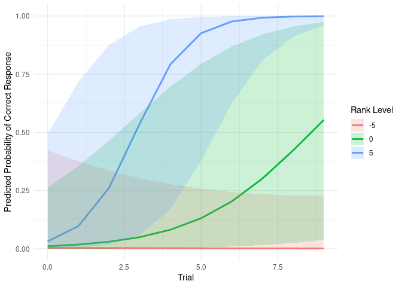

Logistic Regrets 3: plotting a continuous interaction in logistic
regression
================
Michael Chimento

## Introduction

Lets say you have a data-set of individuals’ performance at a task where
you’re interested in understanding the relationship between performance
and a continuous variable, like rank. This is similar to the final
example in the first blog post, except rather than a categorical x
continuous interaction, this is continuous.

## Simulating data

Let’s imagine an experiment that you’ve just designed. You have a
population of birds (let’s say, great tits) that all have been banded
with an RFID code, so you can identify individuals. You have feeders
which have antennas that read their identity, and can give or deny
access to the feeder, based on the identity of the bird. You split the
birds into two groups, where Group A only has access to Feeder A, and
Group B only has access to Feeder B. You’d like to test how quickly the
birds learn, or, how the probability of choosing the “correct” feeder
changes with each visit to the feeder.

Let’s start by defining a vector of identities for individual birds. We
will take advantage of R’s letters variable, which contains the entire
lower case, English alphabet.

``` r
n_individuals <- 20
n_trials <- 10
n_obs <- n_individuals * n_trials

# Create individual IDs
id <- rep(1:n_individuals, each = n_trials)

#simulate ranks for each id
rank <- rnorm(n_individuals, mean = 0, sd = 5)
rank <- rep(rank, each = n_trials)  # repeat for each trial

#simulate some random intercept on performance
random_effect <- rnorm(n_individuals, mean = 0, sd = .5)
random_effect <- rep(rank, each = n_trials)  # repeat for each trial

# create trial numbers
trial <- rep(0:(n_trials - 1), times = n_individuals)

# generate learning curves (logistic function with rank interaction)
beta_intercept <- -2       # baseline log-odds of correct response
beta_trial <- 0.5          # baseline learning rate
beta_rank_trial <- 0.15    # interaction: effect of rank on learning

# calculate log-odds of correct response
log_odds <- beta_intercept + random_effect + beta_trial * trial + beta_rank_trial * rank * trial

# convert to probabilities
prob_correct <- plogis(log_odds)

# simulate correct responses
correct <- rbinom(n_obs, size = 1, prob = prob_correct)

# create dataframe
df <- data.frame(id = as.factor(id), trial, rank, correct)
```

``` r
ggplot(df, aes(x=trial, y=correct))+
  geom_point(alpha=0.1)
```

<!-- -->

## Fit model

Now that we have our dataframe with id, trial, rank, and whether or not
they got it correct that trial, we can fit a logistic mixed effects
model using lme4:

``` r
model <- glmer(correct ~ trial * rank + (1 | id), data = df, family = binomial)
```

To simulate outcomes from our model, we need to create a synthetic
dataset with rank values of interest, trials, and an id column since we
fit a random effects model. Since rank is continuous, we can choose
-sd(rank), mean(rank), and +sd(rank) to get an idea of how the
interaction affects performance.

``` r
# since this is simulated data, we know these values already, but could equally use mean() and sd() functions
rank_mean <- 0
rank_sd <- 5
rank_values <- c(rank_mean - rank_sd, rank_mean, rank_mean + rank_sd)

# create new dataset for prediction
newdata <- expand.grid(
    trial = 0:(n_trials - 1),
    rank = rank_values
)
newdata$id <- NA  # set ID col to na since we're going to average out random effects anyway using re.form

# get predictions on the log-odds (link) scale
pred_link <- predict(model, newdata, type = "link", se.fit = TRUE, re.form = NA)
```

    ## Warning in predict.merMod(model, newdata, type = "link", se.fit = TRUE, :
    ## se.fit computation uses an approximation to estimate the sampling distribution
    ## of the parameters

``` r
# convert fitted values to probability scale
newdata$pred <- plogis(pred_link$fit)

# compute confidence intervals on the log-odds scale and transform
newdata$lower <- plogis(pred_link$fit - 1.96 * pred_link$se.fit)  # 95% CI lower bound
newdata$upper <- plogis(pred_link$fit + 1.96 * pred_link$se.fit)  # 95% CI upper bound

# plot
ggplot(newdata, aes(x = trial, y = pred, color = as.factor(rank))) +
  geom_line(size = 1) +
  geom_ribbon(aes(ymin = lower, ymax = upper, fill = as.factor(rank)), alpha = 0.2, color = NA) +
  labs(
    x = "Trial",
    y = "Predicted Probability of Correct Response",
    color = "Rank Level",
    fill = "Rank Level"
  ) +
  theme_minimal()
```

    ## Warning: Using `size` aesthetic for lines was deprecated in ggplot2 3.4.0.
    ## ℹ Please use `linewidth` instead.
    ## This warning is displayed once every 8 hours.
    ## Call `lifecycle::last_lifecycle_warnings()` to see where this warning was
    ## generated.

<!-- -->

And there you have it! You have visualized the model’s predictions for
low-rank, average-rank and high-rank individuals, along with confidence
intervals. We had to extract predictions and standard errors on the
log-odds scale and transform because while predictions can be output on
response (probability) scale, the standard errors cannot be.
